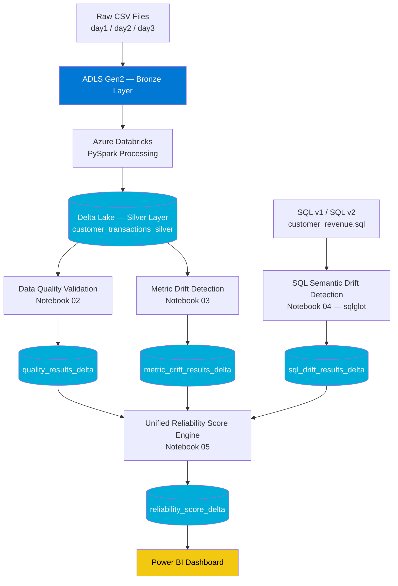

# Metric Drift Observatory — Azure Data Reliability Platform

> An end-to-end data reliability and observability platform built on Azure that automatically detects data quality issues, statistical drift, business metric drift, and silent SQL logic changes across a data pipeline.


---

## Overview

**Metric Drift Observatory** is a portfolio data engineering project that simulates how a data platform team would monitor the *health* of a production data pipeline — not just whether it ran, but whether the **data itself can still be trusted**.

It ingests raw transactional data, promotes it through a Bronze → Silver architecture on Azure Data Lake Storage Gen2, and then runs three independent reliability checks on top of the Silver layer:

1. **Data Quality Validation** — nulls, duplicates, schema drift, business-rule violations
2. **Metric Drift Detection** — statistical and business-KPI drift between daily loads (PSI, volume, correlation, category shift)
3. **SQL Semantic Drift Detection** — parses and diffs two versions of a business-critical SQL query using `sqlglot` to catch silent logic changes that a human reviewer might miss

All three signals are combined into a single **Unified Reliability Score**, giving a one-number, explainable answer to *"can I trust this data today?"*

This project was built end-to-end on an **Azure free-tier subscription** using **synthetic e-commerce transaction data**. It is a learning/portfolio project, not a production system — see [Limitations](#limitations--honest-scope) below.

---

## Business Problem

In most organizations, data pipelines are monitored for *technical* failure (job failed, task timed out) but not for *silent* failure — the pipeline runs successfully every day, yet:

- A source system starts sending more nulls or duplicate records
- Customer behavior or product mix shifts enough to break downstream ML models and dashboards without anyone noticing
- An analyst or engineer quietly edits a "source of truth" SQL query (a join type, a filter, an aggregation) and every report built on top of it changes meaning overnight, with no error and no alert

Metric Drift Observatory answers: **"Is today's data still trustworthy, and if not, why?"** — by scoring quality, statistical stability, and SQL logic stability together instead of treating them as separate concerns.

---

## Solution Architecture

### Architecture Diagram



### High-Level Flow

```
CSV Files
   ↓
ADLS Gen2 Bronze Layer
   ↓
Databricks Spark Processing
   ↓
Delta Lake Silver Layer (customer_transactions_silver)
   ↓
Data Quality Validation (quality_results_delta)
   ↓
Metric Drift Detection (metric_drift_results_delta)
   ↓
SQL Semantic Drift Detection (sql_drift_results_delta)
   ↓
Unified Reliability Score Engine (reliability_score_delta)
   ↓
Power BI Dashboard
```

---

## Azure Services Used

| Service | Role in this project |
|---|---|
| **Azure Data Lake Storage Gen2** | Bronze / Silver / metadata containers; hierarchical namespace for partitioned Delta tables |
| **Azure Databricks** | Spark compute for ingestion, transformation, quality checks, drift detection, and scoring |
| **Delta Lake** | ACID storage format for Silver and all reliability-metric tables; enables schema enforcement and time travel |
| **Apache Spark / PySpark** | Distributed processing engine used across all five notebooks |
| **SQLGlot** | Python SQL parser used to build an AST-level diff between two versions of a business query |
| **Power BI** | Visualization layer for the reliability dashboard |
| *(Optional, referenced in future scope)* Azure Data Factory | Orchestration for scheduling the pipeline end-to-end |

---

## Data Pipeline

**Bronze Layer** — Raw CSV files (`day1.csv`, `day2.csv`, `day3.csv`) representing simulated daily transaction extracts are landed as-is in ADLS Gen2, preserving the original, unprocessed data for lineage and reprocessing.

**Silver Layer** — The three daily files are read, combined, schema-validated, and written as a partitioned Delta table (`customer_transactions_silver`, partitioned by `load_date`). This is the single source of truth the rest of the pipeline reads from.

**Reliability Layer** — Three independent notebooks read the Silver table (and the SQL files) and each write their findings to their own Delta table:
- `quality_results_delta` — data quality score and rule-level pass/fail detail
- `metric_drift_results_delta` — day-over-day statistical and KPI drift
- `sql_drift_results_delta` — semantic diff and risk score between two SQL versions

**Observability Layer** — The Unified Reliability Score Engine reads all three result tables, combines them into a single weighted score with a health status (e.g. Healthy / Watch / At Risk) and a human-readable explanation, and writes the final record to `reliability_score_delta`. This table powers the Power BI dashboard.

---

## Project Components

| Notebook | Purpose |
|---|---|
| `01_ingestion_bronze_to_silver.ipynb` | Reads the three raw daily CSVs from the Bronze container, standardizes and combines them, validates the schema, and writes a partitioned Delta table to the Silver container. |
| `02_data_quality_validation.ipynb` | Runs duplicate detection, null-rate profiling, schema validation, and seven business-rule checks (e.g. `quantity > 0`, `profit_margin` between 0–1) against the Silver table, then computes a composite Data Quality Score and writes it to Delta. |
| `03_metric_drift_detection.ipynb` | Splits the Silver table by `load_date` and compares consecutive days for volume drift, numeric-distribution drift (PSI), category-distribution shift, correlation drift, and KPI drift, rolling everything into an overall drift score. |
| `04_sql_metric_drift_detection.ipynb` | Parses two versions of a customer revenue query with `sqlglot`, extracts semantic metadata (joins, filters, aggregations, grain), diffs the two ASTs, and produces a similarity/risk score for the SQL change. |
| `05_unified_reliability_score_engine.ipynb` | Reads the outputs of notebooks 02–04, combines Data Quality, Metric Stability, and SQL Stability into one weighted Reliability Score with a health status and generated explanation. |

---

## Data Quality Framework

The quality engine checks the Silver table across four dimensions:

- **Completeness** — null-rate per column
- **Uniqueness** — duplicate transactions, duplicate `(customer_id, transaction_date)` pairs
- **Validity (schema)** — missing columns, unexpected columns, data-type mismatches vs. an expected schema
- **Business rules** — 7 rules covering quantity, unit price, total sales, profit margin bounds, delivery days, discount bounds, and return-flag domain

These roll up into a single **Data Quality Score** that feeds the Unified Reliability Score.

## Drift Detection Framework

Drift is measured **day-over-day** on the Silver table:

- **Volume drift** — row-count change between days
- **Numeric drift (PSI)** — Population Stability Index on key numeric columns
- **Category drift** — distribution shift in categorical columns (e.g. region, segment)
- **Correlation drift** — change in correlation structure between numeric features
- **KPI drift** — change in business KPIs (e.g. average order value, active customers) between days

Each component is scored and combined into an overall drift score per day.

## SQL Semantic Analysis

Two versions of the same business query (`customer_revenue_v1.sql` vs `customer_revenue_v2.sql`) are parsed into ASTs with `sqlglot`. The notebook extracts structural metadata (joins, filter predicates, grouping columns, aggregation functions) from each version and diffs them to surface exactly what changed — for example, this project's own v1 → v2 change:

| Change | v1 | v2 |
|---|---|---|
| Customer join | `INNER JOIN customers` | `LEFT JOIN customers` |
| Revenue metric | `SUM(total_sales)` | `SUM(total_sales - discount)` (net sales) |
| Profit aggregation | `SUM(profit)` | `AVG(profit)` |
| Active customers | `COUNT(DISTINCT customer_id)` | `COUNT(customer_id)` (no longer distinct) |
| Date filter | `>= 2024-01-01` | `>= 2024-06-01` |
| Output filter | none | `WHERE revenue > 1000` |

A change like this can silently shift every downstream dashboard's numbers without a single pipeline error — which is exactly the class of risk this module is designed to catch.

## Reliability Score Calculation

The Unified Reliability Score Engine combines three weighted components:

- **Data Quality Score** (from `quality_results_delta`)
- **Metric Stability Score** (from `metric_drift_results_delta`)
- **SQL Stability Score** (from `sql_drift_results_delta`)

into one **Reliability Score**, mapped to a **Health Status** (e.g. Healthy / Watch / At Risk) with an auto-generated plain-English explanation of what's driving the score — written to `reliability_score_delta` for downstream consumption in Power BI.

---

## Results

> Populate this section with real output once you've captured screenshots — see [Dashboard Preview](#dashboard-preview) and `images/` below. Suggested content: sample Data Quality Score, sample Drift Score across the 3 simulated days, sample SQL Risk Score for v1 → v2, and the final Reliability Score with its health status.

## Dashboard Preview


*Add your Power BI screenshot to `images/drift_dashboard.png` — see [docs/architecture.md](docs/architecture.md) and the image checklist below for what to capture.*

---

## Future Enhancements

- Orchestrate the full pipeline with **Azure Data Factory** (currently run manually notebook-by-notebook)
- Add **Great Expectations** or **Deequ** for a more standardized data quality rule engine
- Automate scheduled drift comparisons with **Databricks Jobs**
- Add **CI/CD** via GitHub Actions (lint + unit tests on every PR — see `.github/workflows/`)
- Add **alerting** (e.g. email/Teams webhook) when Reliability Score drops below a threshold
- Extend SQL drift detection to a larger query library, not just one query pair
- Add **data lineage** visualization (e.g. via OpenLineage)

## Skills Demonstrated

`Azure Data Lake Storage Gen2` · `Azure Databricks` · `Apache Spark / PySpark` · `Delta Lake` · `Medallion Architecture (Bronze/Silver)` · `Data Quality Engineering` · `Statistical Drift Detection (PSI)` · `SQL Parsing & AST Diffing (sqlglot)` · `Python` · `SQL` · `Power BI` · `Git/GitHub`

---

## How To Run This Project

> This project was built and run inside **Azure Databricks** notebooks against an **ADLS Gen2** account on a free-tier Azure subscription. It is not designed to run locally end-to-end without an Azure workspace.

1. Provision an Azure Data Lake Storage Gen2 account with `bronze`, `silver`, and `metadata` containers.
2. Provision an Azure Databricks workspace and attach it to the storage account (mount or `abfss://` direct access with a service principal / access connector — **do not hardcode keys**, see `config/`).
3. Upload `data/sample/sample_day1.csv` (or your own daily extracts) to the `bronze` container.
4. Run the notebooks **in order** from `notebooks/`:
   1. `01_ingestion_bronze_to_silver.ipynb`
   2. `02_data_quality_validation.ipynb`
   3. `03_metric_drift_detection.ipynb`
   4. `04_sql_metric_drift_detection.ipynb` (uploads `sql/customer_revenue_v1.sql` and `sql/customer_revenue_v2.sql` to a Databricks Volume first)
   5. `05_unified_reliability_score_engine.ipynb`
5. Query the resulting Delta tables (`customer_transactions_silver`, `quality_results_delta`, `metric_drift_results_delta`, `sql_drift_results_delta`, `reliability_score_delta`) from Power BI via the Databricks SQL connector.

See `config/config.example.yaml` for the configuration values you'll need to set before running.

## Limitations / Honest Scope

This is a **portfolio project** built on Azure free-tier resources with **synthetic transaction data** (3 simulated daily extracts). It demonstrates the *patterns* used in production reliability platforms — it is not orchestrated, scheduled, alerting, or load-tested at production scale. See [Future Enhancements](#future-enhancements) for what a production version would add.

## Author

**[Your Name]** — Aspiring Azure Data Engineer
[LinkedIn](#) · [GitHub](#) · [Portfolio](#)

---

## License

This project is licensed under the [MIT License](LICENSE).
