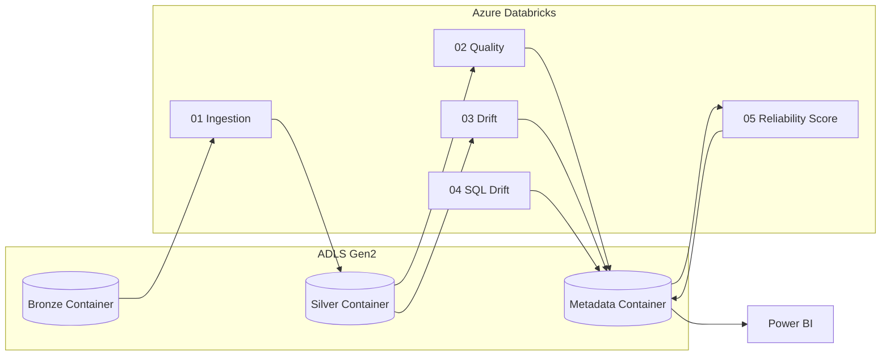

# Architecture

## Purpose of this document

This document explains the technical architecture of Metric Drift Observatory in more depth than the README — it's the doc a technical interviewer or reviewer would read to understand *how* the system is put together, not just what it does.

## Layered Design (Medallion Architecture)

The platform follows a **Bronze → Silver** medallion pattern, extended with a dedicated **reliability/metadata layer**:

- **Bronze container** — raw, unmodified CSV extracts. Never overwritten; append-only landing zone.
- **Silver container** — cleaned, combined, schema-validated Delta table (`customer_transactions_silver`), partitioned by `load_date`.
- **Metadata container** — stores the output Delta tables produced by the three reliability checks plus the final unified score (`quality_results_delta`, `metric_drift_results_delta`, `sql_drift_results_delta`, `reliability_score_delta`).

## Why three independent reliability signals?

A single "is the pipeline healthy" boolean hides *why* something is wrong. This project deliberately keeps three signals separate before combining them, because each catches a different failure mode:

| Signal | Catches |
|---|---|
| Data Quality | Structural/completeness problems in *this run's* data (nulls, duplicates, broken business rules) |
| Metric Drift | *Distributional* change over time — data is individually valid but the population has shifted |
| SQL Semantic Drift | Logic changes in *how* data is transformed — the data and pipeline can be perfectly healthy, but the meaning of a metric changed |

Combining them into one Reliability Score (see `docs/drift_detection_methodology.md`) gives one number for a dashboard, while each Delta table preserves the detail for root-cause analysis.

## Compute

All processing runs as **PySpark** jobs inside **Azure Databricks** notebooks. Each notebook is independently runnable and idempotent with respect to its output Delta table (re-running a notebook overwrites/merges that run's output rather than duplicating it).

## Why Delta Lake

Delta Lake was chosen over plain Parquet for every layer because the project needs:
- **ACID writes** so partial/failed notebook runs don't corrupt downstream tables
- **Schema enforcement** to make schema drift *detectable* rather than silently accepted
- **Time travel** so historical reliability scores and drift results remain queryable for trend analysis in Power BI

